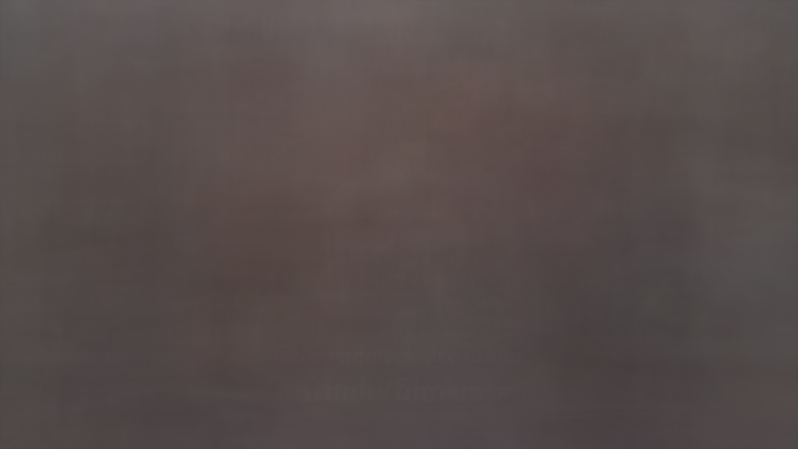
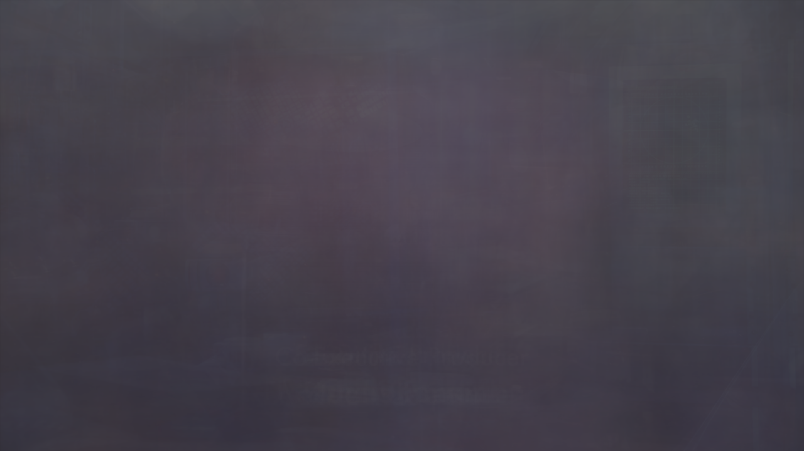
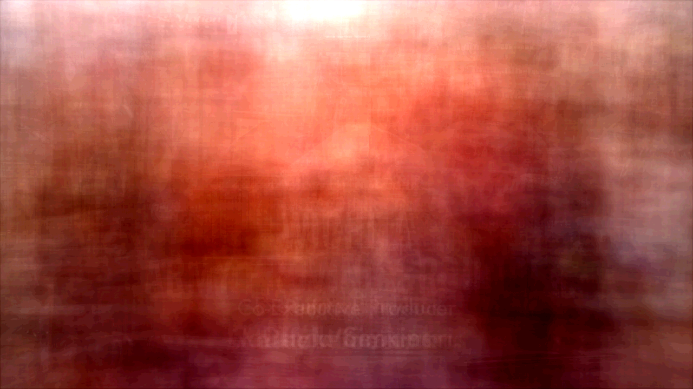
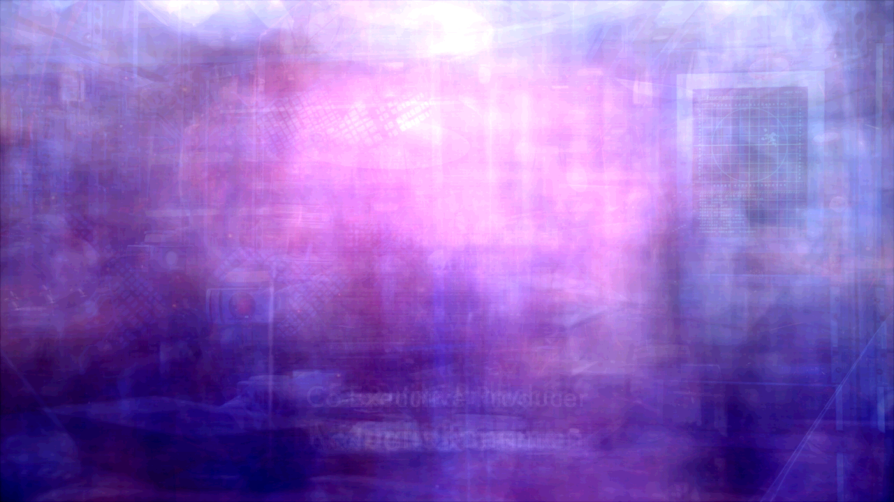

# Illuminated Averages

The idea is to create one image out of a full movie.
The impressions are averaged leaving an impression of what stayed the same and what changed. 
The result is a kind of "ghost" image of the movie.

The idea was invoked from a Youtube video about doing this to soundtracks: https://www.youtube.com/watch?v=JzRlnxs-qDk

The original idea is from Jim Campbell: https://www.jimcampbell.tv/portfolio/illuminated-averages

## Techniques

In general, we go through the whole video frame by frame, accumulating the data.
Finally, we compute the average out of this data.

Main problems are the runtime (even shorter episodes can have 100k frames) and the memory (storing all frames is not possible 6MB per frame (3 Byte/Pixel * 1920 * 1080)).

### Average

In the simplest case, we sum up all color values (channel-wise) and divide by the number of frames at the end.

Technical details:
- The image is handled as a long w * h * 3 array of u8 values (for RGB)
- We gamma correct as the human eye perceives brightness logarithmically (that is, do the average in value^2.2 space)
- We use a producer/consumer pattern to process the frames in parallel (but not too many at the same time to avoid memory issues)

### Random Pixels

A common pixel should by definition occur often.
We can sample a few (or a single) value per pixel location and use this value.

In the simplest case, we use reservoir sampling. With probability 1/i, we replace the current value with the new one. By telescope summing, this results in a uniform distribution over all frames.

With a few pixels selected this way, we can use more complex techniques to combine them, e.g. a histogram or median. This is not implemented yet.

### Median

### Grouping (not implemented)

A true histogram on the whole movie would be possible if we restrict the data to store.
For instance, we can group similar color values together by restricting the 0..255 range to 0..15 (8 bit to 4 bit) and store the count of each group.

## Post-processing

After computing the averages, the result is usually a uniform brown/gray image.
To make it more visually appealing, we can apply some contrast enhancement techniques.
The best results can be achieved by using imagemagick's "normalize" function.

## Examples

The examples by [Jim Campbell](https://www.jimcampbell.tv/portfolio/illuminated-averages) are quite impressive, check them out. I suspect that the process involves more than just simple averaging.

Here are two examples of the [Warehouse 13 show](https://en.wikipedia.org/wiki/Warehouse_13).

With enhanced contrast:

